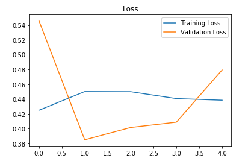
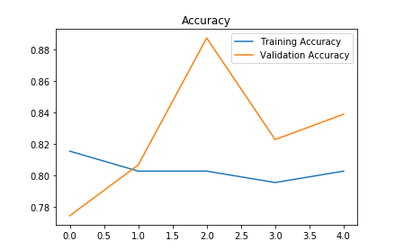
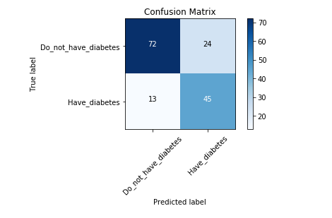

# Diabetes Prediction

Pima Indian diabetes prediction using CNN.

## Data set

- The dataset contains 768 records.
- You can download the dataset from: [Kaggle](https://www.kaggle.com/uciml/pima-indians-diabetes-database)

## Dependencies

- Keras
- numpy
- pandas
- sklearn
- matplotlib
- itertools

## Data split

The data was split in the following way: 

- 80% of the data for training and validation.
- 20% of the data from the dataset is used for testing.

## Build the model

- A model with the 3 Dense layers generated for training the dataset.

## Training the model

The model was trained for 505 epochs and these are the loss and accuracy plots:

*The model has overfit the data. You can add more data for better results.[Overfitting](https://www.youtube.com/watch?v=DEMmkFC6IGM)

## Performance Analysis

### Confusion Matrix

### F1_measure

0.7086614173228

### Accuracy score

0.7597402597402597

### Recall

0.7758620689655172

### Precision

0.6521739130434783

To view more on how to evaluate performance analysis of a model visit : [Performance measures](https://blog.exsilio.com/all/accuracy-precision-recall-f1-score-interpretation-of-performance-measures/) 
